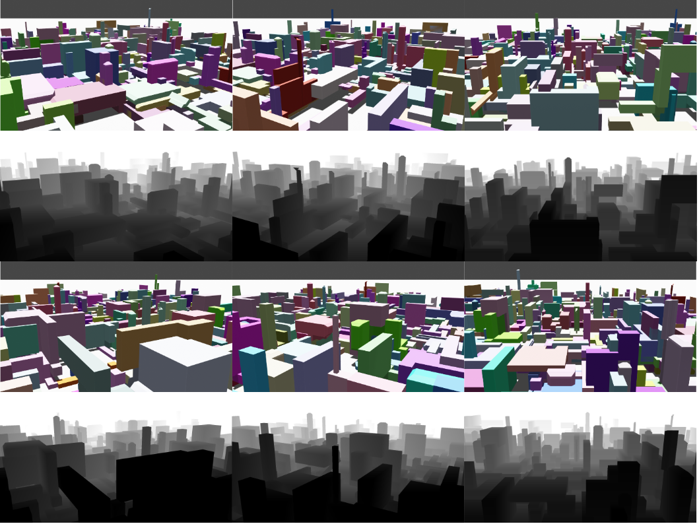

#  3D dataset generator
<!-- /TOC -->
This repository contains a Blender program to generate random 3D datasets. Including the original image and corresponding depth map.
<p align="center"></p>
<!-- TOC -->

- [Requirements](#Requirements)
- [Features](#Features)
- [How to use](#How-to-use)
	- [Run with default settings](#Run-with-default-settings)
    - [Customize your dataset](#Customize-your-dataset)
- [Config file](#Config-file)


## Requirements
The program is executed through Blender's built-in scripting editor. Requires Blender 3.2 or higher.

## Features

- An easy to navigate structure.
- A `json` configuration file to easily customize the program.
- The program generates a randomized scene. Filled with configurable random extrusion/shrink/inset/offset with random texture and randomized lighting.
- Rotate & orbit camera around the center of the scene to capture 360 deg scan.
- A composited node tree is available for customize rendering and output configurations.
- The program outputs the original PNG image, corresponding PNG depth map and OpenEXR depth map. And saves a copy of the scene.

## How to use

### Run with default settings
Open `default_void.blend` with Blender, go to  `Scripting` tab and run `main.py`. You can also use an empty new scene. Before executing the script, enable Blender console at `Window -> Toggle System Console` to see the system messages. Collect the outputs under `output/` .
### Customize your dataset
`config.json` is available for customization. The `"node":` settings work for the provided setup. For transformed PNG depth map, the values (clipping range) might need to be reconfigured manually after changing the world and camera settings. You can do this by adjusting the `Map Range` node under `Compositing` tab according to the visualized `viewer` node. Or by rerendering the scene without running the script. Note that the visualized depth is diferent from the output PNG. Check [official documents](https://docs.blender.org/manual/en/latest/compositing/types/output/file.html) for more information. The OpenEXR always saves the original Z-path information.


## Config file
Config file is in `.json` format:
```javascript
{
  "cube": {
      "cubeSize" : 3,			# cube size, blender default 2
      "scaleX" : 1,				# x sacel in object creation
      "scaleY" : 1,				# y sacel in object creation
      "scaleZ" : 1				# z sacel in object creation
  },
  "light": {
      "light_base1" : 200,		# base light position
      "light_base2" : 300
  },
  "generation": {
      "exTime" : 7,				# time of extrusion
      "extrDistanceMax" : 15,	# max distance of extrusion
      "extrDistanceMin" : 2,	# min distance of extrusion
      "randomStep" : 3,			# step between values in random
      "shrink_P" : 0,			# chance of shrink
      "shrink_val" : 2,			# shrink value
      "inset_P" : 10,			# chance of inset
      "inset_thickness" : 1,	# inset value
      "offset_P" : 90,			# chance of offset
      "offset_val" : 1,			# offset values
      "plane_S" : 3000			# base plane size
  },
  "node": {
      "node_range_min" : 50,	# depth transform clipping range
      "node_range_max" : 200
  },
  "camera": {
      "cam_location_X" : 140,
      "cam_location_Y" : 0,
      "cam_location_Z" : 36,
      "cam_len" : 33,			# camera lens
      "rotate_interval" : 60	# camera rotation interval
  },
  "global": {
      "render_compression" : 70,	# render compression rate
      "Eevee" : true,				# render engine
      "Cycles" : false,				# GPU support only available for Cycles engine
      "GPU" : true,					# use GPU
      "mem_tile" : 2048,			# memory tiling
      "sample_rate" : 1024			# multi-sample rate
  }
}


```


